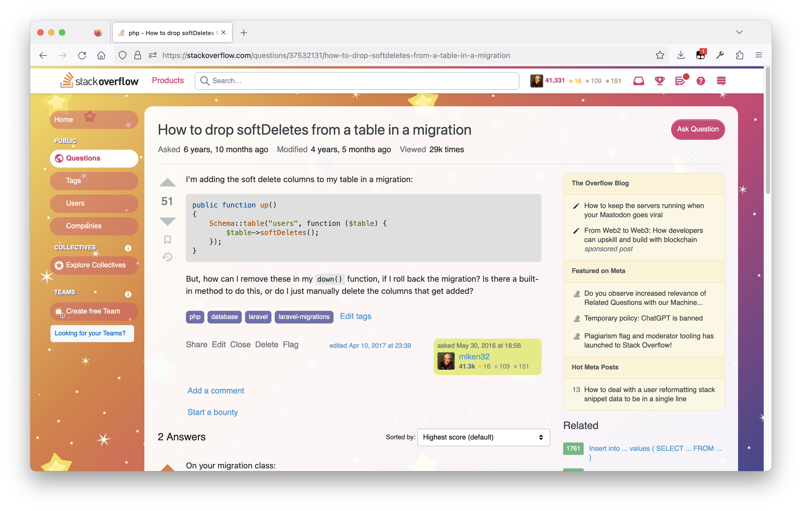

# Frisa Lank Stack Overflow theme
It started as an April Fool's joke in 2022, but somehow I've been using it for a year and have grown fond of it. Look at this beauty:

All credit belongs to [Piper Lawson](https://twitter.com/UxPiper/status/1509973940508188695), Director of Product design at SO.
